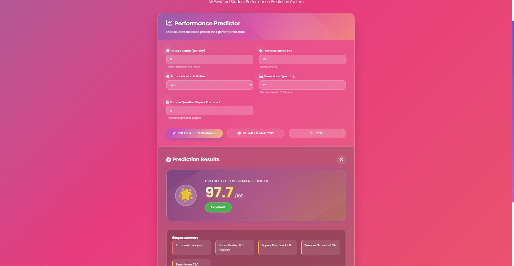

# 🎓 Student Performance Predictor

An AI-powered web application that predicts student academic performance based on key study habits and lifestyle factors using Machine Learning.

## 📊 Features

- Predicts student performance index (0-100)
- Analyzes 5 key factors:
  - Hours studied per day
  - Previous exam scores
  - Extracurricular activities participation
  - Sleep hours per day
  - Number of practice papers solved
- Provides instant predictions with personalized recommendations
- Beautiful, responsive UI with animations

## 🚀 Screenshot 



## 🛠️ Tech Stack

- **Backend:** Flask (Python)
- **Machine Learning:** Scikit-learn (Linear Regression)
- **Frontend:** HTML5, CSS3, JavaScript
- **Model:** Multiple Linear Regression (R² Score: 98.88%)

## 📈 Model Performance

- **Algorithm:** Linear Regression
- **R² Score:** 0.9888
- **Features:** 5 input features
- **Training Data:** 10,000 student records

### Feature Coefficients
| Feature | Coefficient |
|---------|------------|
| Hours Studied | 2.85 |
| Previous Scores | 1.02 |
| Extracurricular | 0.61 |
| Sleep Hours | 0.48 |
| Papers Practiced | 0.19 |

## 🏃‍♂️ Run Locally

1. Clone the repository:
```bash
git clone https://github.com/yourusername/student-performance-predictor.git
cd student-performance-predictor